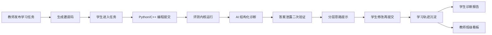
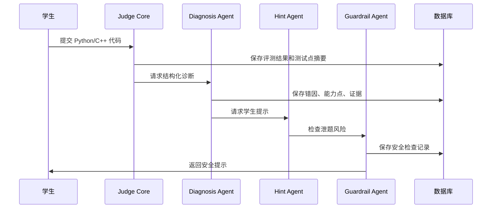

# Spec: 温中 AI 编程学习辅助平台 1.0

## 1. 定位

本项目 1.0 版本不再以 OJ 为产品形态，而是面向温岭中学信息技术学科建设一套 AI 编程学习辅助平台。

原开源 OJ 的价值在于提供代码提交、测试点运行、评测结果、提交历史等底层能力。1.0 要保留这条评测内核链路，但推倒并重建外层产品语言、页面结构、教学业务模型、AI 诊断流程和教师/学生使用场景。

一句话定位：

> 面向高中信息技术课堂与竞赛训练的 AI 编程学习辅助与过程评价平台。

核心闭环：



## 2. 背景与机会

温岭中学信息技术学科需要的不只是一个刷题系统，而是一个能辅助学生学习、帮助教师掌握学习过程的数据化平台。

传统 OJ 的短板：

- 只告诉学生对错，缺少下一步学习方向。
- 老师难以批量查看学生到底卡在哪里。
- 提交过程数据没有被转化为教学洞察。
- 排行榜和 AC 文化容易把学习导向竞速，而不是理解。

1.0 的机会：

- 用已有评测内核快速得到可运行闭环。
- 用 AI 把代码错误转化为标准化诊断。
- 用过程数据支持形成性评价。
- 用不泄题的分层提示帮助学生持续修改。
- 用教师看板让老师看到班级共性问题和个体干预对象。

## 3. 目标

1.0 目标是做出一个足够完整、可试点、可演示、可继续迭代的温中版本。

### 3.1 学生目标

- 学生通过邀请码进入学习任务，不需要正式账号登录。
- 支持 Python 和 C++ 提交。
- 学生提交后看到运行反馈、主要问题、思路方向提示。
- AI 提示不能直接给答案、完整代码或隐藏测试点。
- 学生能看到自己多次尝试之间的变化，例如语法错误减少、边界问题反复、复杂度未改善。

### 3.2 教师目标

- 教师能创建班级、学习任务和邀请码。
- 教师能绑定题目、设置任务时间、设置提示上限。
- 教师能查看学生提交、完整代码、AI 诊断、学习轨迹。
- 教师能看到班级层面的高频错因、题目卡点和需要关注的学生。
- 教师能导入题目、测试点和学生数据，尽量支持多种格式。

### 3.3 平台目标

- 页面和语言彻底去 OJ 化。
- 保留并封装原评测能力为 Judge Core。
- 建立错因标签库、能力点库、提示层级库、泄题风险库。
- 所有 AI 诊断尽量结构化，便于后续统计、报告和个性化学习。
- 1.0 可本地/内网试点部署，后续再升级安全沙箱和正式权限系统。

## 4. 非目标

1.0 暂不做以下内容：

- 不做完整统一身份认证系统。
- 不对接学校教务系统。
- 不做正式学业评价或等级认证。
- 不把排行榜作为核心功能。
- 不追求完整竞赛智能教练能力。
- 不让 AI 生成标准答案代码。
- 不做大规模公网多人并发生产级沙箱。

这些可以进入 1.1/2.0，但不能压垮 1.0。

## 5. 产品原则

### 5.1 学生优先

第一优先级是让学生在编程过程中获得有效帮助。教师看板服务于学生学习，而不是把平台做成单纯管理后台。

### 5.2 去 OJ 化

产品表达避免使用 AC、WA、排行榜、刷题、判题等强 OJ 语言。建议映射：

| 原 OJ 语言 | 1.0 产品语言 |
| --- | --- |
| 题库 | 学习任务库 |
| 题目 | 学习任务 / 练习 |
| 判题 | 运行与反馈 |
| 提交 | 学习尝试 |
| AC | 已通过 |
| WA | 需要调整 |
| TLE | 效率待优化 |
| CE | 语法/编译需修正 |
| 排行榜 | 班级学习概览 |
| 提交历史 | 学习轨迹 |

### 5.3 AI 不替代学生思考

AI 的职责是指出问题、给方向、帮助定位，不是给答案。默认只提供思路与方向，必要时给局部解释，但不输出完整代码。

### 5.4 教师在环

AI 诊断结果需要能被教师查看、理解和修正。低置信度结果应标记不确定，不应伪装成确定结论。

### 5.5 过程评价

平台关注学生多次提交的变化，而不是只看一次结果。核心价值是把学生学习过程显影出来。

## 6. 用户与场景

### 6.1 学生

高中信息技术学生，以 Python 为主，同时支持 C++。包含普通课堂学生和部分竞赛训练学生。

典型场景：

1. 学生收到老师的邀请码。
2. 输入邀请码进入学习任务。
3. 填写班级、姓名、学号/座号等临时身份信息。
4. 阅读任务，选择 Python 或 C++。
5. 提交代码。
6. 查看运行反馈和 AI 思路提示。
7. 根据提示修改，再次提交。
8. 查看自己的学习轨迹和阶段性诊断。

### 6.2 教师

温中信息技术教师。

典型场景：

1. 教师创建班级或临时学习小组。
2. 导入或手动录入学生名单。
3. 创建学习任务，选择题目，设置截止时间和提示策略。
4. 生成邀请码给学生。
5. 上课过程中查看实时提交状态。
6. 课后查看班级高频错因、题目卡点、学生代码和诊断报告。
7. 根据系统建议决定补讲、个别辅导或安排前置练习。

### 6.3 校方/教研展示

校方不关心具体代码细节，关心：

- AI 是否真正进入教学过程。
- 是否帮助教师减负。
- 是否能看到学生学习过程。
- 是否符合信息技术学科发展方向。
- 是否可形成温中特色案例。

因此 1.0 建议准备一个“教学成果概览”页面或报告导出能力，用于演示。

## 7. 1.0 功能范围

### 7.1 学生学习入口

功能：

- 邀请码进入学习任务。
- 无正式登录。
- 学生首次进入时填写临时身份信息：
  - 班级
  - 姓名
  - 学号/座号
  - 可选备注
- 同一浏览器保存本次身份，方便继续提交。
- 若学生清空缓存，可重新输入身份。

风险：

- 无登录意味着身份可信度有限。
- 1.0 可接受，因为定位是课堂辅助和试点，不是正式评价。

缓解：

- 教师端显示身份来源和首次进入时间。
- 同名同号冲突时提醒教师。
- 后续 1.1 可加入轻量学生 PIN。

### 7.2 学习任务库

功能：

- 教师创建/编辑学习任务。
- 每个任务可包含：
  - 标题
  - 描述
  - 难度
  - 适用语言：Python/C++
  - 能力点标签
  - 任务类型：课堂基础 / 提高训练 / 竞赛训练
  - 时间限制和内存限制
  - 公开样例和隐藏测试点
  - AI 提示策略
  - 教师备注

### 7.3 教师作业管理

功能：

- 创建班级/学习小组。
- 创建作业。
- 作业绑定一个或多个学习任务。
- 设置开始时间、截止时间。
- 设置邀请码。
- 设置提示上限：
  - 只允许 L1
  - 允许 L1-L2
  - 允许 L1-L3
  - 允许 L1-L4，但仍禁止答案代码
- 查看作业完成情况。
- 查看学生提交记录和完整代码。

### 7.4 Python/C++ 提交与评测

功能：

- 支持 Python。
- 支持 C++。
- 评测返回：
  - 是否通过
  - 运行时间
  - 内存使用
  - 编译/语法错误
  - 运行错误
  - 测试点级结果
- 隐藏测试点不向学生暴露具体输入输出。

技术策略：

- 复用原 OJ 的 LocalCodeExecutor/JudgeService。
- 将其包装为 Judge Core。
- 学生端只展示教育化反馈，不直接展示 OJ 式状态。

安全说明：

- 1.0 本地/内网试点可继续使用本地执行。
- 若真实多人长期使用，需要升级容器沙箱、进程隔离、资源限制和文件系统隔离。

### 7.5 AI 结构化诊断

每次提交后生成 DiagnosisRecord，至少包含：

```json
{
  "submission_id": "sub_001",
  "student_ref": "class1_no12",
  "assignment_id": "assign_001",
  "problem_id": "problem_001",
  "language": "python",
  "verdict": "NEEDS_ADJUSTMENT",
  "issue_tags": ["BOUNDARY_CASE", "LOOP_BOUNDARY"],
  "ability_points": ["边界条件", "循环控制"],
  "evidence": [
    {
      "type": "FAILED_TEST_PATTERN",
      "summary": "公开样例通过，但边界类测试未通过"
    }
  ],
  "hint_level": 2,
  "student_hint": "请重点检查最小输入和循环结束条件。",
  "progress_signal": "语法问题已解决，当前主要问题转向逻辑边界。",
  "teacher_note": "该学生可能需要补充循环边界检查方法。",
  "confidence": 0.86,
  "needs_teacher_review": false
}
```

原则：

- AI 先选标准标签，再生成文字。
- 不允许 AI 自由发明标签。
- 低置信度结果标记 needs_teacher_review。
- 诊断结果既服务学生提示，也服务教师统计。

### 7.6 AI 二次验证

所有将展示给学生的 AI 输出必须经过 Guardrail Check。

检查项：

- 是否包含完整代码。
- 是否包含完整函数。
- 是否包含可直接复制的伪代码。
- 是否给出关键解法公式或状态转移完整表达。
- 是否暴露隐藏测试点输入输出。
- 是否绕过教师设置的提示上限。
- 是否把竞赛题的核心算法路径讲得过于完整。

风险等级：

| 等级 | 处理 |
| --- | --- |
| LOW | 展示 |
| MEDIUM | 自动改写后展示 |
| HIGH | 不展示，退回重新生成 |
| BLOCKED | 显示保守提示，并记录教师可查看事件 |

保守提示示例：

> 当前提示可能过于接近答案，系统已为你收敛为方向性提醒：请重新检查边界条件和循环范围。

### 7.7 学生学习轨迹

学生端展示：

- 最近提交列表。
- 每次提交的教育化状态。
- AI 识别出的主要问题。
- 本次相较上次的变化。
- 当前建议关注的能力点。

轨迹信号示例：

- 语法错误减少。
- 从语法问题进入逻辑调试阶段。
- 连续 3 次出现边界问题。
- 正确性改善，但复杂度未改善。
- 修改幅度很大但问题类型未变化。
- 只通过公开样例，隐藏场景泛化不足。

### 7.8 教师班级看板

教师端首页建议显示：

- 当前作业参与人数。
- 已提交人数。
- 已通过人数。
- 多次尝试仍未解决人数。
- 高频错因 Top 5。
- 高频能力薄弱点 Top 5。
- 卡点最明显的题目。
- 需要关注的学生列表。
- 只差一步的学生列表。
- 复杂度问题突出的学生列表。

教师可以下钻：

- 班级 -> 学生 -> 作业 -> 提交 -> 代码 -> AI 诊断。
- 作业 -> 题目 -> 错因分布 -> 学生列表。
- 能力点 -> 相关题目 -> 相关学生。

### 7.9 学生报告与教师报告

学生报告：

- 本阶段完成情况。
- 主要进步。
- 高频问题。
- 下一步建议。
- 推荐复习能力点。

教师报告：

- 作业整体情况。
- 班级共性问题。
- 题目卡点。
- 学生分层建议。
- 需要补讲的知识点。
- 可导出为 Markdown/PDF，后续支持 Excel。

### 7.10 多格式导入

1.0 尽量支持：

- CSV
- Excel xlsx
- JSON
- ZIP 批量包

导入对象：

- 学生名单
- 题目描述
- 测试点
- 作业题目组合

学生名单暂时没有真实格式，因此先提供宽松模板：

| class_name | student_no | student_name | note |
| --- | --- | --- | --- |
| 高一1班 | 12 | 张三 | 可选 |

导入策略：

- 字段自动识别常见别名，如班级/class、姓名/name、学号/no。
- 导入前 dry-run 预览。
- 冲突项提示教师确认。
- 不静默覆盖已有学生。

## 8. 标准库设计

### 8.1 错因标签库

第一批一级标签：

| ID | 名称 | 说明 |
| --- | --- | --- |
| SYNTAX_ERROR | 语法/编译错误 | Python 语法错误、C++ 编译错误 |
| IO_FORMAT | 输入输出格式错误 | 读入、输出格式、换行、空格问题 |
| VARIABLE_INIT | 变量初始化问题 | 初值、未初始化、复用变量 |
| CONDITION_BRANCH | 条件分支错误 | if/else 判断遗漏或条件错误 |
| LOOP_BOUNDARY | 循环边界错误 | 起止范围、闭区间/开区间错误 |
| BOUNDARY_CASE | 边界条件遗漏 | 最小值、最大值、空输入、单元素 |
| DATA_STRUCTURE | 数据结构选择不当 | 数组/列表、字典/map、集合等选择不合适 |
| TIME_COMPLEXITY | 时间复杂度过高 | 算法在大规模输入下超时 |
| SPACE_COMPLEXITY | 空间复杂度过高 | 不必要存储、内存超限 |
| RECURSION_BASE | 递归出口错误 | 递归终止、栈溢出 |
| STATE_TRANSITION | 状态转移错误 | DP 或状态模拟转移不正确 |
| SAMPLE_OVERFIT | 只通过样例不能泛化 | 针对样例写死或泛化不足 |
| DEBUGGING_METHOD | 调试方法不足 | 盲目修改、无效提交重复 |
| READABILITY | 代码可读性差 | 命名、结构、重复代码影响理解 |

语言特定补充：

Python：

- PY_INDENTATION
- PY_TYPE_MISMATCH
- PY_MUTABLE_ALIAS
- PY_INPUT_SPLIT

C++：

- CPP_HEADER_MISSING
- CPP_ARRAY_OUT_OF_BOUNDS
- CPP_INTEGER_OVERFLOW
- CPP_UNINITIALIZED_VALUE
- CPP_FAST_IO_NEEDED

### 8.2 能力点库

基础能力：

- Python 基础语法
- C++ 基础语法
- 输入输出
- 变量与表达式
- 条件分支
- 循环控制
- 列表/数组
- 字符串处理
- 函数

提高能力：

- 枚举
- 模拟
- 排序
- 查找
- 字典/map
- 集合/set
- 前缀和
- 二分
- 递归
- DFS/BFS
- 贪心
- 动态规划入门
- 复杂度分析

竞赛增强能力：

- 图论基础
- 最短路
- 并查集
- 堆/优先队列
- 单调栈/队列
- 区间 DP
- 背包 DP
- 状态压缩
- 数学与数论基础

### 8.3 提示层级库

| 等级 | 名称 | 学生可见内容 |
| --- | --- | --- |
| L1 | 问题类型提示 | 只指出可能的问题类型 |
| L2 | 检查方向提示 | 给出应该检查的输入范围或代码区域 |
| L3 | 局部定位提示 | 指出可能相关的行、条件或循环 |
| L4 | 思路框架提示 | 给出高层解题方向，但不提供完整代码 |

默认策略：

- 课堂基础题允许到 L3。
- 提高题允许到 L2-L3。
- 竞赛题默认 L1-L2，教师可手动放宽到 L3。
- L4 需要教师在作业中明确允许。

### 8.4 泄题风险库

风险模式：

- 完整程序。
- 完整函数。
- 可直接复制的伪代码。
- 标准解法步骤完整展开。
- DP 状态定义和转移方程完整给出。
- 隐藏测试点输入输出。
- 题目关键 trick 直接揭示。
- 直接指出应使用某个唯一算法并给出实现细节。

### 8.5 进步信号库

| ID | 名称 | 解释 |
| --- | --- | --- |
| CE_DECREASED | 编译/语法错误减少 | 基础语法熟练度提升 |
| CE_TO_WA | 从语法进入逻辑调试 | 学生已越过语法层问题 |
| WA_TO_TLE | 正确性改善但效率不足 | 解法方向接近但复杂度不够 |
| SAME_ISSUE_REPEATED | 同类问题重复出现 | 需要教师或更明确脚手架 |
| COMPLEXITY_NOT_IMPROVED | 复杂度未改善 | 算法意识薄弱 |
| BOUNDARY_REPEATED | 边界问题重复出现 | 需要边界测试训练 |
| EFFECTIVE_SMALL_STEPS | 小步有效修改 | 调试过程健康 |
| LARGE_UNEXPLAINED_CHANGE | 大幅修改但无解释 | 可能存在复制或无目标试错 |

## 9. 数据模型

### 9.1 复用模型

继续复用并逐步适配：

- Problem -> LearningTask
- TestCase -> TaskTestCase
- Submission -> LearningAttempt
- SubmissionCaseResult -> AttemptCaseResult
- SubmissionAnalysis -> DiagnosisRecord

代码层面可以先保留旧类名，通过 DTO 和页面语言去 OJ 化；中期再重命名领域模型。

### 9.2 新增核心模型

```text
ClassGroup
- id
- name
- grade
- teacherName
- createdAt

StudentProfile
- id
- classGroupId
- displayName
- studentNo
- note
- identityKey
- createdAt
- lastSeenAt

Assignment
- id
- title
- description
- classGroupId
- startsAt
- endsAt
- hintPolicy
- status
- createdAt

AssignmentInvite
- id
- assignmentId
- code
- enabled
- expiresAt
- createdAt

AssignmentTask
- id
- assignmentId
- problemId
- orderIndex
- required

LearningAttempt
- id
- assignmentId
- problemId
- studentProfileId
- language
- sourceCode
- verdict
- executionTime
- memoryUsed
- submittedAt

DiagnosisRecord
- id
- attemptId
- issueTagsJson
- abilityPointsJson
- evidenceJson
- hintLevel
- studentHint
- teacherNote
- progressSignal
- confidence
- needsTeacherReview
- createdAt

HintSafetyCheck
- id
- diagnosisId
- riskLevel
- blockedReasonsJson
- originalHint
- safeHint
- checkedAt

LearningProfileSnapshot
- id
- studentProfileId
- assignmentId
- summaryJson
- weakPointsJson
- progressSignalsJson
- generatedAt
```

## 10. 后端架构

建议包结构逐步改为：

```text
com.wenzhong.aicoding
|- judge              评测内核适配层
|- learning           学习任务与学生尝试
|- classroom          班级、学生、邀请码
|- assignment         作业发布与管理
|- diagnosis          AI诊断、标签库、提示生成
|- guardrail          答案泄露二次验证
|- reporting          学生报告与教师报告
|- importcenter       CSV/Excel/JSON/ZIP导入
|- shared             通用异常、配置、工具
```

考虑到当前项目已有 `com.onlinejudge`，1.0 可采用两步：

第一步：在现有包下新增 learning/classroom/assignment/diagnosis/guardrail 等模块，快速交付。

第二步：稳定后整体迁移包名和页面品牌。

## 11. API 草案

### 11.1 学生端

```http
POST /api/invites/resolve
GET  /api/student/assignments/{inviteCode}
POST /api/student/identity
GET  /api/student/assignments/{assignmentId}/tasks
GET  /api/student/tasks/{taskId}
POST /api/student/attempts
GET  /api/student/attempts/{attemptId}
GET  /api/student/tasks/{taskId}/timeline
GET  /api/student/reports/{assignmentId}
```

### 11.2 教师端

```http
GET    /api/teacher/classes
POST   /api/teacher/classes
POST   /api/teacher/classes/{classId}/students/import
GET    /api/teacher/assignments
POST   /api/teacher/assignments
PUT    /api/teacher/assignments/{assignmentId}
POST   /api/teacher/assignments/{assignmentId}/invite
GET    /api/teacher/assignments/{assignmentId}/overview
GET    /api/teacher/assignments/{assignmentId}/students
GET    /api/teacher/attempts/{attemptId}
GET    /api/teacher/reports/{assignmentId}
```

### 11.3 题目/任务管理

```http
GET    /api/teacher/tasks
POST   /api/teacher/tasks
PUT    /api/teacher/tasks/{taskId}
POST   /api/teacher/tasks/import
POST   /api/teacher/tasks/{taskId}/testcases/import
```

## 12. 前端信息架构

### 12.1 学生端页面

1. 邀请码入口页
   - 输入邀请码
   - 展示任务名称和老师信息

2. 学生身份页
   - 班级
   - 姓名
   - 学号/座号

3. 学习任务列表页
   - 当前作业包含的任务
   - 完成状态
   - 当前建议关注点

4. 做题页
   - 左侧任务描述
   - 中间代码编辑器
   - 右侧智能反馈
   - 下方学习轨迹

5. 学生报告页
   - 我的进步
   - 我的高频问题
   - 下一步建议

### 12.2 教师端页面

1. 教师工作台
   - 今日/当前作业
   - 班级学习概览
   - 需要关注学生

2. 班级管理页
   - 班级列表
   - 学生列表
   - 导入学生

3. 学习任务管理页
   - 创建/编辑任务
   - 测试点管理
   - 能力点标注

4. 作业管理页
   - 创建作业
   - 绑定任务
   - 生成邀请码
   - 设置提示策略

5. 作业看板页
   - 完成率
   - 高频错因
   - 题目卡点
   - 学生分层

6. 学生详情页
   - 学习轨迹
   - 提交代码
   - AI 诊断
   - 教师备注

7. 报告中心
   - 学生报告
   - 班级报告
   - 导出

## 13. UI 方向

视觉上应像学校教学工具，而不是竞赛站点。

原则：

- 安静、清晰、可信。
- 信息密度适中，适合老师课堂快速查看。
- 学生端强调“下一步怎么做”。
- 教师端强调“哪里需要我介入”。
- 不使用排行榜作为首页核心。
- 不用炫技式 AI 聊天窗口替代结构化反馈。

建议导航：

学生端：

```text
学习任务 / 智能反馈 / 学习轨迹 / 我的报告
```

教师端：

```text
工作台 / 班级 / 学习任务 / 作业 / 诊断看板 / 报告
```

## 14. AI Agent 设计

### 14.1 Diagnosis Agent

输入：

- 题目描述
- 能力点标签
- 学生代码
- 语言
- 评测结果
- 测试点摘要
- 历史提交摘要

输出：

- issue_tags
- ability_points
- evidence
- confidence
- teacher_note

### 14.2 Hint Agent

输入：

- DiagnosisRecord
- 作业提示策略
- 学生历史
- 题目难度

输出：

- hint_level
- student_hint
- next_step

### 14.3 Guardrail Agent

输入：

- student_hint
- 题目内容
- 参考思路/内部标签
- 隐藏测试点摘要，不含原文
- 提示策略

输出：

- risk_level
- blocked_reasons
- safe_hint

### 14.4 Learning Trace Agent

输入：

- 同一学生同一任务的多次提交和诊断

输出：

- progress_signal
- repeated_issues
- teacher_intervention_suggestion

### 14.5 Teacher Insight Agent

输入：

- 作业下所有学生诊断

输出：

- 高频错因
- 班级薄弱能力点
- 题目卡点
- 学生分层建议
- 补讲建议

## 15. 诊断流程



## 16. 竞赛能力路线

1.0 支持竞赛训练入口，但不承诺完整竞赛教练。

1.0 能做到：

- Python/C++ 均可提交。
- 对复杂度、数据结构、边界、实现细节做基础诊断。
- 任务可标注为竞赛训练。
- 竞赛题默认更严格防泄题。

1.1/2.0 扩展：

- 算法知识图谱。
- 题型模板库。
- 复杂度自动推断增强。
- DP/搜索/图论专项诊断。
- 竞赛训练报告。

## 17. 导入规范

### 17.1 学生名单

支持 CSV/XLSX/JSON。

字段：

- class_name
- student_no
- student_name
- note

### 17.2 题目

支持 Markdown/JSON/ZIP。

字段：

- title
- description
- difficulty
- supported_languages
- ability_points
- time_limit
- memory_limit
- sample_cases
- hidden_cases
- teacher_notes

### 17.3 测试点

支持 CSV/JSON/ZIP。

字段：

- input
- expected_output
- hidden
- order_index
- note

导入必须先预览，不直接覆盖。

## 18. 实施计划

### Phase 0: 基线整理

- 梳理当前 OJ 功能。
- 确定保留评测内核。
- 隐藏或降级排行榜。
- 更新项目定位文档。

### Phase 1: 产品外壳重建

- 新学生入口。
- 新教师工作台。
- 新导航。
- 页面文案去 OJ 化。
- 做题页重构为学习任务页。

### Phase 2: 教学业务模型

- ClassGroup
- StudentProfile
- Assignment
- AssignmentInvite
- AssignmentTask
- LearningAttempt 适配

### Phase 3: AI 标准化诊断

- 错因标签库。
- 能力点库。
- 提示层级库。
- DiagnosisRecord。
- 结构化输出校验。

### Phase 4: AI 二次验证

- Guardrail 检查。
- 风险等级。
- 自动改写。
- BLOCKED 保守提示。

### Phase 5: 学习轨迹与报告

- 学生学习轨迹。
- 学生报告。
- 教师班级看板。
- 教师报告。

### Phase 6: 导入与演示打磨

- 学生名单导入。
- 题目/测试点导入。
- 温中演示数据。
- 演示故事线打磨。

## 19. 验收标准

### 19.1 学生闭环

- 学生可通过邀请码进入作业。
- 学生可填写临时身份。
- 学生可查看作业任务。
- 学生可提交 Python。
- 学生可提交 C++。
- 学生可看到教育化运行反馈。
- 学生可看到不泄题 AI 提示。
- 学生可看到学习轨迹。

### 19.2 教师闭环

- 教师可创建班级。
- 教师可创建作业。
- 教师可生成邀请码。
- 教师可绑定学习任务。
- 教师可查看学生提交和完整代码。
- 教师可查看 AI 诊断。
- 教师可查看班级高频错因。
- 教师可看到需要关注的学生。

### 19.3 AI 闭环

- 每次提交产生结构化诊断。
- 诊断只使用标准标签。
- AI 提示经过泄题风险检查。
- 高风险提示不展示给学生。
- 低置信度诊断标记教师复核。

### 19.4 导入闭环

- 可导入 CSV 学生名单。
- 可导入 Excel 学生名单。
- 可导入 JSON 题目。
- 导入前有预览。
- 不静默覆盖已有数据。

### 19.5 演示闭环

演示时必须能讲清楚三个故事：

1. 学生连续提交，AI 逐步给方向，学生改进。
2. 老师看到班级高频问题和需要关注学生。
3. 平台沉淀信息技术学习过程数据，体现 AI 赋能教学。

## 20. 风险与缓解

| 风险 | 影响 | 缓解 |
| --- | --- | --- |
| 本地代码执行安全不足 | 多人真实使用有风险 | 1.0 限内网试点，后续升级容器沙箱 |
| 无登录身份不可信 | 学生可能冒名 | 1.0 用邀请码+学号姓名，后续加 PIN |
| AI 泄露答案 | 破坏教学目标 | Guardrail 二次验证，教师提示上限 |
| AI 诊断不稳定 | 教师不信任 | 标准标签、置信度、教师复核 |
| C++ 环境缺失 | C++ 无法运行 | 部署前检查 g++，提供环境诊断 |
| 竞赛诊断难度高 | 误判复杂问题 | 1.0 做基础诊断，竞赛深诊断进 1.1/2.0 |
| 旧 OJ 结构牵制产品 | 页面和数据混乱 | 评测内核适配，产品层重建 |
| 导入格式多样 | 容易失败 | 先做模板和 dry-run，再扩展识别 |

## 21. 需要继续确认

这些点不会阻塞 Spec，但会影响实现细节：

1. 教师端 1.0 是否需要一个简单教师访问码，还是本地默认开放教师入口？
2. 学生身份字段是否固定为班级、姓名、学号/座号？
3. 温中第一批题目大约多少道，偏课堂还是竞赛？
4. 是否需要为校方汇报单独做“AI 赋能教学成果页”？
5. C++ 运行环境由谁部署，是否允许安装 g++？
6. AI 模型使用 ModelScope 继续，还是准备切换到其他模型服务？
7. 报告导出 1.0 优先 PDF、Markdown 还是 Excel？

## 22. 推荐决策

我的推荐是：

- 1.0 先做完整课堂试点闭环，而不是做竞赛全能力。
- 页面全部去 OJ 化，但评测内核继续复用。
- 学生端优先于教师端，但教师端必须有作业和看板。
- Python/C++ 都支持运行，AI 深度诊断先以 Python 更强，C++ 保证基础可用。
- AI 提示默认 L1-L2，教师可放宽到 L3，L4 谨慎开放。
- 先做 CSV/XLSX/JSON 导入，ZIP 作为增强。
- 1.0 使用 H2 可演示，正式试点建议准备 PostgreSQL/MySQL 迁移方案。

## 23. 版本完成定义

1.0 完成不是指“所有功能都写满”，而是指下面这条链路稳定成立：

> 教师创建作业并发出邀请码，学生进入后完成 Python/C++ 提交，系统评测并生成不泄题的 AI 诊断，学生根据提示多次修改，教师能看到学生过程和班级共性问题。

只要这条链路真实可用，平台就已经从 OJ 变成了 AI 编程学习辅助平台。

## 24. 从现有代码到 1.0 的施工清单

当前代码已经具备 Problem、TestCase、Submission、JudgeService、LocalCodeExecutor、SubmissionAnalysis、AiReportService、GrowthReportService 等能力。施工时不要一上来删光，而是按“先包一层，再替换外壳，再重建领域”的方式推进。

### 24.1 第一批改动：产品壳与入口

- 新增学生邀请码入口页。
- 新增教师工作台首页。
- 隐藏或弱化排行榜入口。
- 首页从“题库”改为“学习任务”。
- problem.html 改造成学习任务详情与智能反馈页。
- problem-create.html 改造成教师任务编辑页。
- 所有 AC/WA/TLE/CE 的前端展示改为教育化状态。

验收：

- 用户打开首页时不再感到这是 OJ。
- 学生可以从邀请码进入任务。
- 教师可以从工作台进入任务和作业管理。

### 24.2 第二批改动：课堂业务模型

- 新增 ClassGroup。
- 新增 StudentProfile。
- 新增 Assignment。
- 新增 AssignmentInvite。
- 新增 AssignmentTask。
- Submission 增加 assignmentId/studentProfileId，或通过关联表适配。

验收：

- 一个作业可以绑定多个任务。
- 一个邀请码可以进入一个作业。
- 一个学生身份可以产生多次提交。
- 教师能按作业和学生查看提交。

### 24.3 第三批改动：AI 标准化

- 新增标准标签枚举或数据表。
- 新增能力点枚举或数据表。
- 重构 SubmissionAnalysis 输出为 DiagnosisRecord。
- AiReportService 输出 JSON Schema。
- 增加结构化结果校验，拒绝未知标签。

验收：

- 每次提交至少生成 issue_tags、ability_points、evidence、confidence。
- 教师看板可按 issue_tags 统计。
- 学生提示来自 DiagnosisRecord，而不是自由文本拼接。

### 24.4 第四批改动：答案泄露二次验证

- 新增 GuardrailService。
- 新增 HintSafetyCheck。
- 对所有 student_hint 做展示前检查。
- 高风险输出自动重写或阻断。
- 教师端可看到被阻断记录。

验收：

- AI 输出完整代码时不会展示给学生。
- AI 输出隐藏测试点时不会展示给学生。
- 竞赛题提示默认更保守。

### 24.5 第五批改动：学习轨迹与看板

- 新增同一学生同一任务的提交时间线。
- 新增进步信号计算。
- 新增作业 overview API。
- 新增教师看板图表和学生列表。
- 新增学生个人报告。
- 新增教师作业报告。

验收：

- 能展示学生从第一次到最后一次提交的问题变化。
- 能展示班级高频错因。
- 能展示需要关注的学生。

### 24.6 第六批改动：导入与演示数据

- 学生名单 CSV 导入。
- 学生名单 Excel 导入。
- 题目 JSON 导入。
- 测试点 CSV/JSON 导入。
- 导入 dry-run 预览。
- 准备温中演示数据集。

验收：

- 教师能用模板导入学生名单。
- 导入不会静默覆盖已有数据。
- 演示环境有一套完整故事数据。

## 25. 1.0 演示脚本

演示不要从功能菜单开始，要从教学故事开始。

### 25.1 学生故事

1. 老师发出邀请码。
2. 学生输入邀请码进入作业。
3. 学生提交一份有语法问题的 Python 代码。
4. 系统提示“语法/编译需修正”，不给答案。
5. 学生修正后再次提交，进入边界问题。
6. 系统提示检查最小输入和循环范围。
7. 学生第三次提交，正确性改善但效率不足。
8. 系统提示复杂度方向，但不说完整算法。
9. 学生报告显示“语法问题已改善，当前需要关注复杂度”。

### 25.2 教师故事

1. 教师进入作业看板。
2. 看到全班提交率和通过情况。
3. 看到高频错因是循环边界、输入输出格式、时间复杂度。
4. 点击循环边界，看到相关学生和题目。
5. 点击某个学生，查看完整代码和 AI 诊断链路。
6. 系统给出“建议补讲边界测试构造方法”。

### 25.3 校方故事

1. 展示 AI 不是替学生写代码，而是提供分层提示。
2. 展示平台沉淀学习过程数据。
3. 展示教师可以用数据调整教学。
4. 总结为“温中信息技术 AI 赋能学习过程评价试点”。

## 26. 1.0 成功标准

商业上，1.0 成功不是功能数量最多，而是温中老师和校方形成三个判断：

- 这不是普通刷题网站，而是懂教学过程的 AI 学习平台。
- 学生确实能得到有边界的帮助，不是直接抄答案。
- 老师确实能更快掌握班级学习状况。

工程上，1.0 成功是：

- 旧 OJ 的评测内核被成功封装。
- 新教育产品层可以独立演进。
- AI 诊断结果可统计、可复核、可防泄题。
- 学生端和教师端形成完整闭环。

后续 1.1/2.0 再重点加强：

- 正式账号体系。
- 容器化评测沙箱。
- 更强竞赛诊断。
- 算法知识图谱。
- 更完整的学校数据治理和报告体系。
