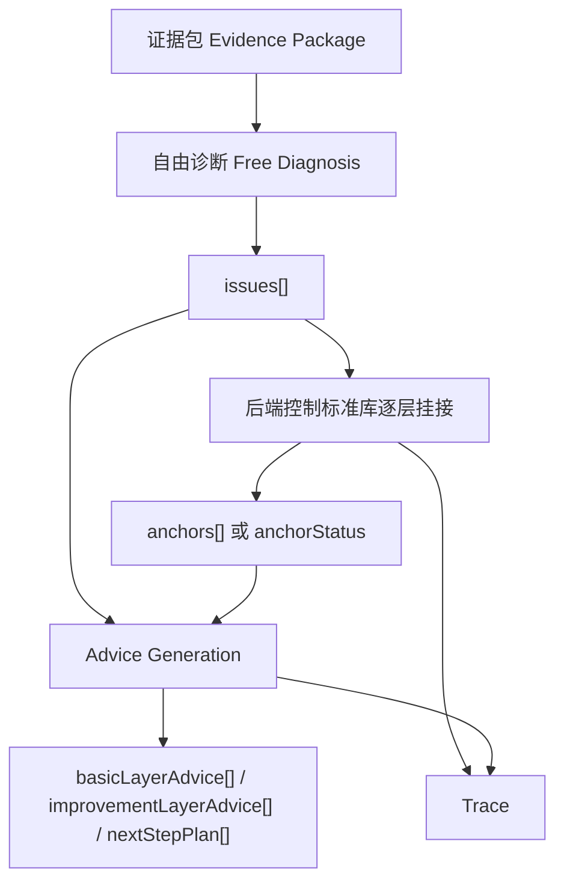
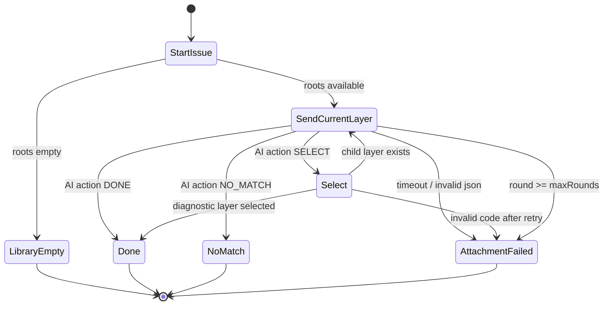

# AI 诊断 issue-first 主链路 Spec

## 0. 执行提示词

本次重构的目标不是修补旧 `CONTINUE / selectedBranches / selectedPaths` 协议，而是替换默认主链路。

执行时必须遵守：

- AI 先诊断当前提交的多个真实错误，输出 `issues[]`。
- 后端控制标准库逐层目录浏览，AI 只在当前层做选择。
- 标准库挂接是辅助，不是闸门；挂不上也必须继续生成学生建议。
- 多个 issue 必须能生成多条基础建议和提高建议。
- 每次真实模型评测必须能看到阶段化请求、响应、后端判定和降级原因。
- 不用 seed 修空标准库测试；空标准库是必须被正确降级的场景。

## 1. 已确认失败链路

trace 文件：

```text
target/ai-simulation-reports/ai-request-trace-20260708-proxy.jsonl
```

样本：

```text
分层优惠最短路多状态剪枝错误
Python 3
源码 226 行
失败样例：
3 3 1
1 2 5
2 3 5
1 3 100

期望：7
实际：10
```

### 1.1 请求 1：自由诊断成功

后端发送：

```text
task = 先独立理解题目、完整代码和判题事实，生成不含标准库 ID 的初步诊断。
brief.sourceCodeLineCount = 226
brief.evidenceRefs = [judge:first_failed_case]
```

模型返回了多个问题：

```text
1. 优惠券折扣计算错误
   evidenceRefs = [code:148, judge:first_failed_case]

2. 全局剪枝忽略已用优惠券层数
   evidenceRefs = [code:118-119]

3. 最终答案仅取精确 k 层而非最多 k 层
   evidenceRefs = [code:166]
```

结论：模型在自由诊断阶段能识别多个真实错误。多条建议没有出现，不是因为模型只能诊断一个错误。

### 1.2 请求 2：标准库导航拿到空目录

后端发送给标准库导航阶段的关键数据：

```json
{
  "navigationView": {
    "round": 1,
    "roots": [],
    "expandedNodes": [],
    "diagnosticLayers": [],
    "visibleKnowledgeNodeCodes": [],
    "visibleDiagnosticCodes": {
      "knowledgeNodeCodes": [],
      "skillUnitCodes": [],
      "mistakePointCodes": [],
      "improvementPointCodes": []
    },
    "mustFinishNow": false
  }
}
```

模型返回：

```json
{
  "status": "CONTINUE",
  "selectedBranches": [],
  "selectedPaths": [],
  "unresolvedGaps": [],
  "uncertainty": "当前标准库导航视图无可见节点，无法进行分支选择。请先展开标准库根节点以提供可选择的代码。"
}
```

后端判定：

```text
STANDARD_LIBRARY_NAVIGATION / INVALID_JSON
CONTINUE navigation requires selectedBranches.
```

结论：本次失败的直接原因是后端给了空目录，却仍要求 AI 选择目录；架构层原因是标准库导航失败直接阻断 advice generation。

## 2. 目标链路



主规则：

```text
诊断是否成立，看 issues。
标准库是否命中，看 anchors。
学生建议是否生成，看 issues + evidence。
标准库失败不决定诊断失败。
```

## 3. Schema

### 3.1 自由诊断输出

```json
{
  "problemUnderstanding": "string",
  "codeIntent": "string",
  "behaviorGap": "string",
  "issues": [
    {
      "issueId": "I1",
      "title": "优惠券折扣计算错误",
      "whatHappened": "string",
      "whyItMatters": "string",
      "evidenceRefs": ["code:148", "judge:first_failed_case"],
      "severity": "BLOCKING|MAJOR|MINOR",
      "confidence": 0.95
    }
  ],
  "uncertainty": "string"
}
```

校验规则：

- `issues` 可以有 1 到多条。
- 每个 issue 必须有 `issueId`。
- `evidenceRefs` 必须合法。
- 单条 issue 非法，只丢弃或降级该 issue，不清空其他 issue。
- 自由诊断不允许输出标准库 ID。

### 3.2 标准库逐层挂接请求

后端每轮只给当前层：

```json
{
  "task": "为当前 issue 从当前可见标准库目录中选择下一层，或结束挂接。",
  "issue": {
    "issueId": "I1",
    "title": "优惠券折扣计算错误",
    "whatHappened": "string",
    "evidenceRefs": ["code:148", "judge:first_failed_case"]
  },
  "breadcrumb": [
    {
      "code": "ALGO_GRAPH",
      "name": "图论",
      "type": "KNOWLEDGE_NODE"
    }
  ],
  "currentLayer": {
    "round": 2,
    "maxRounds": 6,
    "nodes": [
      {
        "code": "ALGO_GRAPH_SHORTEST_PATH",
        "name": "最短路",
        "type": "KNOWLEDGE_NODE",
        "description": "string"
      }
    ],
    "diagnosticItems": []
  },
  "allowedActions": ["SELECT", "DONE", "NO_MATCH"]
}
```

### 3.3 标准库逐层挂接响应

AI 只能返回最小动作：

```json
{
  "action": "SELECT",
  "codes": ["ALGO_GRAPH_SHORTEST_PATH"],
  "reason": "该 issue 涉及分层最短路状态转移。",
  "confidence": 0.86
}
```

规则：

- `SELECT` 只能选择 `currentLayer.nodes` 或 `currentLayer.diagnosticItems` 中的 code。
- `codes` 第一版默认最多 2 个。
- `DONE` 表示当前 breadcrumb 或诊断层足够。
- `NO_MATCH` 表示当前 issue 在当前标准库下找不到合适路径。
- 不要求导航阶段返回 `evidenceRefs`。
- 不允许返回 `selectedBranches`、`selectedPaths`、`unresolvedGaps` 作为主协议。

### 3.4 issue 标准库 anchor

```json
{
  "issueId": "I1",
  "anchorStatus": "HIT|PARTIAL|NO_MATCH|LIBRARY_EMPTY|ATTACHMENT_FAILED",
  "path": [
    {
      "code": "ALGO_GRAPH",
      "name": "图论",
      "type": "KNOWLEDGE_NODE"
    },
    {
      "code": "ALGO_GRAPH_SHORTEST_PATH",
      "name": "最短路",
      "type": "KNOWLEDGE_NODE"
    }
  ],
  "skillUnitCode": "string|null",
  "mistakePointCode": "string|null",
  "improvementPointCode": "string|null",
  "reason": "string",
  "confidence": 0.86
}
```

### 3.5 advice generation 输入

```json
{
  "brief": "ModelDiagnosisBrief",
  "issues": [
    {
      "issueId": "I1",
      "title": "优惠券折扣计算错误",
      "whatHappened": "string",
      "whyItMatters": "string",
      "evidenceRefs": ["code:148", "judge:first_failed_case"]
    }
  ],
  "libraryAnchors": [
    {
      "issueId": "I1",
      "anchorStatus": "PARTIAL",
      "path": ["图论", "最短路"]
    }
  ],
  "rules": {
    "generateBasicAdvicePerIssue": true,
    "standardLibraryIsOptional": true,
    "doNotLeakFullAnswer": true
  }
}
```

## 4. 后端状态机



状态含义：

| 状态 | 结果 |
|---|---|
| `LibraryEmpty` | `anchorStatus=LIBRARY_EMPTY`，不调用 AI 选目录 |
| `NoMatch` | `anchorStatus=NO_MATCH`，继续 advice |
| `AttachmentFailed` | `anchorStatus=ATTACHMENT_FAILED`，继续 advice |
| `Done` | 生成 `IssueLibraryAnchor`，继续 advice |

## 5. 降级矩阵

| 场景 | 后端处理 | advice 是否继续 | 整链状态 |
|---|---|---:|---|
| 标准库根目录为空 | 不调用导航 AI，所有 issue 标记 `LIBRARY_EMPTY` | 是 | 成功或 advice 阶段状态 |
| 当前层无可选 code | 当前 issue 标记 `NO_MATCH` | 是 | 成功或 advice 阶段状态 |
| AI 返回 `SELECT` 但 codes 为空 | 当前 issue 标记 `NO_MATCH` 或重问一次 | 是 | 成功或 advice 阶段状态 |
| AI 返回非法 code | 丢弃非法 code，可重问一次；仍非法则 `ATTACHMENT_FAILED` | 是 | 成功或 advice 阶段状态 |
| AI 返回无法解析 JSON | 当前 issue `ATTACHMENT_FAILED` | 是 | 成功或 advice 阶段状态 |
| AI 超时 | 当前 issue `ATTACHMENT_FAILED` | 是 | 成功或 advice 阶段状态 |
| AI 输出截断 | 当前 issue `ATTACHMENT_FAILED` | 是 | 成功或 advice 阶段状态 |
| 自由诊断无合法 issue | advice 不执行 | 否 | `MODEL_FAILED` |
| advice generation 失败 | 无学生建议 | 否 | `MODEL_FAILED` |

关键边界：

```text
只有自由诊断失败或 advice generation 失败，才会导致学生 AI 诊断失败。
标准库挂接失败不导致学生 AI 诊断失败。
```

## 6. 旧链路删除或绕开清单

默认主链路中必须移除或绕开：

- `CONTINUE / DONE / NO_MATCH` 作为模型自管状态机的主协议。
- `selectedBranches` 作为继续展开的必填字段。
- `selectedPaths` 作为导航阶段最终锚点主字段。
- 导航阶段 `evidenceRefs` 硬要求。
- `CONTINUE + selectedBranches=[]` 直接整链失败。
- 标准库导航失败直接返回 `MODEL_FAILED`。
- 整题只保留一个标准库路径。
- advice generation 依赖 `StandardLibraryPack` 非空才能运行。

可以保留：

- 旧 DTO 作为历史测试或迁移兼容。
- 旧 telemetry 字段用于读取历史报告。
- 标准库服务的目录读取和节点展开方法。

## 7. 自动化测试断言

至少增加以下测试：

1. **空标准库不阻断 advice**
   - 给自由诊断返回 3 个合法 issues。
   - 标准库根目录返回空。
   - 断言不调用标准库选择模型。
   - 断言 advice generation 收到 3 个 issues。
   - 断言结果不是 `STANDARD_LIBRARY_NAVIGATION/INVALID_JSON`。

2. **多 issue 独立挂接**
   - issue I1 挂接成功。
   - issue I2 返回 `NO_MATCH`。
   - issue I3 返回非法 code 后降级。
   - 断言 I1 anchor 保留，I2/I3 不影响 I1。
   - 断言 advice 输入仍包含 I1/I2/I3。

3. **多条建议保真**
   - advice generation 返回 3 条基础建议和 2 条提高建议。
   - normalizer / mapper / view assembler 不能只保留第一条。
   - 报告逐题明细展示多条建议。

4. **导航阶段不要求 evidenceRefs**
   - 标准库挂接 action 不带 evidenceRefs。
   - 断言 validator 接受合法 action。
   - 证据校验只在 issue 和 advice 阶段执行。

5. **真实 trace 可复盘**
   - 运行第一道高级长代码样本。
   - trace 至少包含 `FREE_DIAGNOSIS`、`LAYERED_ATTACHMENT`、`ADVICE_GENERATION` 或明确跳过原因。
   - 报告包含 trace 文件路径。

## 8. 第一版实现范围

第一版只做主链路最小闭环：

- `issues[]`。
- 后端控制逐层挂接。
- 空标准库和挂接失败降级。
- advice 基于 issues 继续生成。
- trace 落盘。

不做：

- 新增标准库内容。
- 向量召回。
- 教师治理台改版。
- 成长候选复杂合并。
- 前端大改版。

