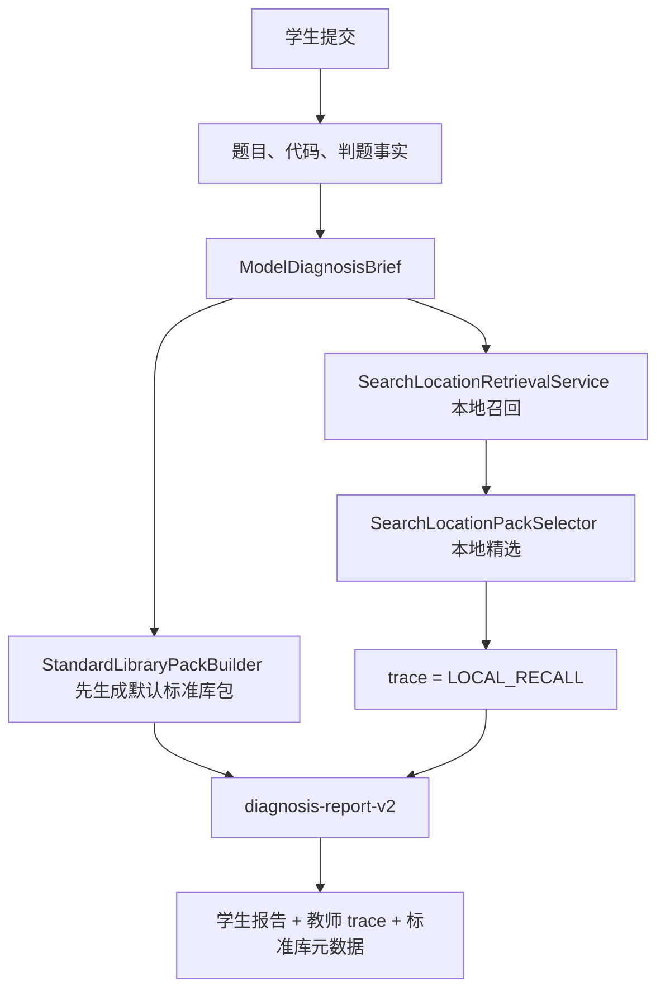
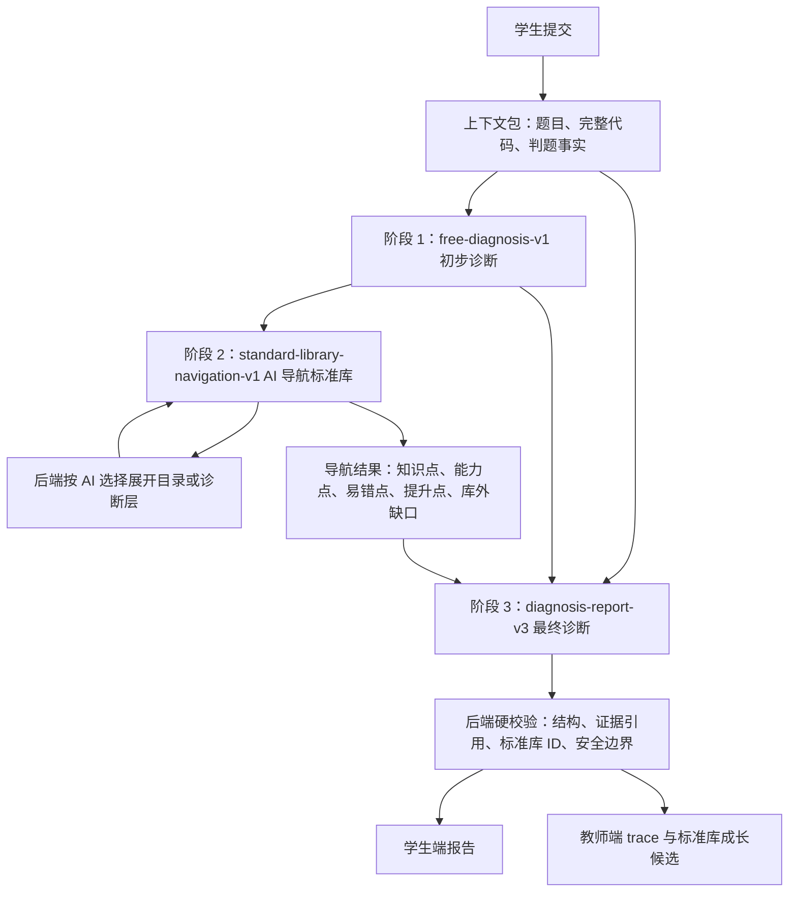

# AI 诊断链路替换方案：从本地召回到 AI 标准库导航

## 1. 本轮真实目标

这次不是再多加一个搜索模块，而是把学生 AI 诊断主链路从“后端先本地召回候选，再让模型诊断”改成“模型先读题和代码形成初步判断，再像深搜一样浏览标准库，最后按标准库术语生成正式诊断”。

最终目标有四个：

- 不再保留本地召回作为默认主链路。
- 不再让高中库、竞赛库、知识树和标准库互相平行。
- 让标准库以“知识点 -> 能力点 -> 易错点/提升点”的结构被 AI 导航读取。
- 让前端看到的学生报告仍然简洁，后端保留可审计的导航路径和标准库命中信息。

## 2. 当前链路为什么会混乱

当前代码和规格已经有多轮演进痕迹，方向并不完全一致：

- `ExternalModelAgentRuntime.prepare(...)` 会先构造 `ModelDiagnosisBrief`，再立即调用 `StandardLibraryPackBuilder.build(brief)` 生成标准库包。
- `AiReportService.prepareStudentFeedbackRuntimePlan(...)` 默认调用 `applyLocalSearchLocationOnly(...)`。
- `AiReportService.applySearchLocationIfAvailable(...)` 即使外部搜索定位关闭，也会调用 `SearchLocationRetrievalService.retrieve(...)` 做本地召回，并把 trace 标记为 `LOCAL_RECALL`。
- `SearchLocationRetrievalService` 会根据题目、代码、判题结果、文本分数和可选向量分数从标准库中挑候选。
- 当前 OpenSpec 仍写着“默认实时链路使用本地召回和一次外部诊断 Agent”。

这就导致一个根本问题：项目记忆里已经确定“外部模型独立诊断，后端只做结构校验和标准库 ID 校验”，但实际代码仍让后端先替模型决定标准库方向。

这个链路的坏处不是“本地召回不够聪明”这么简单，而是责任边界错了：后端召回会在模型完整理解代码之前先缩窄方向，导致模型容易围绕候选解释，而不是先判断真实错误。

## 3. 目标链路

目标链路分三段，但学生可见内容只来自最后一段。

阶段 1 的 AI 不看标准库，只看题目、代码和判题事实，输出初步判断：

- 题目目标。
- 学生代码意图。
- 实际行为差距。
- 可能错因假设。
- 证据引用。
- 标准库导航意图，但不输出标准库 ID。

阶段 2 的 AI 不需要后端打分，也不需要本地召回。它按标准库树逐层选择：

1. 后端返回一级目录。
2. AI 选择 1-3 个大章节。
3. 后端展开被选章节的子章节。
4. AI 继续选择小章节或知识点。
5. 后端展开知识点下的能力点、易错点和提升点。
6. AI 返回最终选择的标准库锚点，以及标准库没有覆盖的缺口。

阶段 3 的 AI 同时读取原始上下文、初步诊断和标准库导航结果，生成正式学生报告与后端元数据。

## 4. 模块命运表

| 模块 | 现在做什么 | 目标状态 |
| --- | --- | --- |
| `ExternalModelAgentRuntime.prepare` | 构造 brief，并提前生成 `StandardLibraryPack` 和 `search-location-v1` prompt | 只构造运行时上下文和三阶段 prompt，不提前决定标准库包 |
| `StandardLibraryPackBuilder` | 根据 brief、标签和默认逻辑生成候选包 | 改成“按 AI 导航结果组装最终标准库包”的工具，不再默认先跑 |
| `SearchLocationRetrievalService` | 本地文本/结构/向量召回标准库候选 | 退出生产主链路；最多保留为离线评测或历史兼容，不参与默认诊断 |
| `SearchLocationPackSelector` | 把召回候选转成 selected pack | 退出默认链路；最终 pack 由 AI 导航选择结果驱动 |
| `search-location-v1` | 可选外部搜索定位，对本地候选再精选 | 被 `standard-library-navigation-v1` 替代 |
| `LOCAL_RECALL` trace | 标记默认本地召回成功 | 被 `AI_NAVIGATION`、`AI_NAVIGATION_FAILED` 等状态替代 |
| `diagnosis-report-v2` | 使用题目、代码、判题结果和候选标准库生成报告 | 升级为 `diagnosis-report-v3`，输入初步诊断和 AI 导航结果 |
| `AdviceGenerationOutputValidator` | 校验结构、证据、安全和标准库 ID | 保留并扩展：校验导航锚点、库外缺口、未知 ID 软修复边界 |
| `AiStandardLibraryService` | 提供标准库条目和兼容读取 | 增加导航 API：目录读取、子树展开、知识点诊断层展开 |

## 5. 最终返回形态

后端仍然可以返回结构化 JSON，但产品理解上应把它看成一段可读报告加一组审计信息。

后端返回给前端的主内容应该能被组装成这样的长段：

> 【基础层诊断】你这次没有通过，主要卡在“循环队列队尾移动后没有保持取模”的边界处理上。证据是第 18 行入队后直接 `rear = rear + 1`，当队尾走到数组末尾时，下一次访问会越过队列空间，和第 2 个测试点出现的运行时错误一致。这个问题对应标准库路径“队列与循环队列 -> 循环队列下标维护 -> 队尾更新未取模”。【诊断证据】`code:line:18`、`judge:case:2`。【提高层诊断】等你修掉基础错误后，可以再检查满队和空队条件是否用同一套状态定义，否则同一道题在边界数据下还可能误判。【下一步动作】先手算一个长度为 3 的循环队列，连续执行 4 次入队和 2 次出队，把每一步的 `front/rear` 写出来，再对照代码检查哪一步开始不一致。

前端学生端看到的内容仍然应该是一段自然报告，但可以拆成固定区块展示：

- 类型：基础层诊断；内容：说明当前最阻塞通过的问题、标准术语和证据。
- 类型：诊断证据；内容：代码行、测试点、错误输出或样例差异。
- 类型：提高层诊断；内容：修掉基础错误后的算法、边界、复杂度或建模提升。
- 类型：下一步动作；内容：学生马上能做的小动作，不给完整答案和可复制改法。

教师端和后台 trace 额外保留：

- 类型：初步诊断；内容：AI 在未看标准库时对题目、代码和判题事实的理解。
- 类型：导航路径；内容：AI 选择的大章节、小章节、知识点、能力点、易错点和提升点。
- 类型：库外缺口；内容：标准库没有覆盖但本题真实出现的错因候选，状态为待审核。
- 类型：校验结果；内容：结构是否合法、证据是否可映射、标准库 ID 是否存在、是否发生软修复。

## 6. 失败行为

这次设计先不做 AI 自查循环，也不做 AI 自动资产直接入库。

失败行为必须简单：

- 初步诊断失败：返回 AI 暂不可用，不生成本地替代诊断。
- 标准库导航失败：返回 AI 暂不可用或标记该阶段失败，不回退本地召回。
- 最终诊断失败：返回 AI 暂不可用，不用标准库条目拼一个假报告。
- AI 发现库外缺口：只进入待审核成长候选，不直接写入正式标准库。

## 7. 验收清单

实现完成后必须满足这些检查：

- 默认学生实时诊断不调用 `SearchLocationRetrievalService.retrieve(...)`。
- 默认链路不生成 `LOCAL_RECALL`。
- 默认链路不调用 `search-location-v1`。
- `StandardLibraryPackBuilder.build(brief)` 不再在 `prepare(...)` 阶段提前执行。
- 新 trace 至少能区分 `FREE_DIAGNOSIS`、`AI_NAVIGATION`、`FINAL_DIAGNOSIS`、`FAILED`。
- 标准库导航最多展开有限轮次，避免把全库一次性塞进 prompt。
- AI 导航可以选择“没有合适易错点”，并形成待审核成长候选。
- 最终学生报告仍然只有基础层、提高层、证据和下一步行动，不暴露内部导航过程。
- 教师端 trace 可以看到 AI 走过的知识路径和最终标准库锚点。
- 导航失败不会回退本地召回，也不会伪装成 AI 成功。
- 测试中要能证明旧召回服务在默认路径没有被调用。
- OpenSpec 中所有仍要求本地召回默认启用的条款必须被替换或移除。

## 8. 分阶段落地

第一阶段只做规格和边界：写清当前链路、目标链路、禁用项和验收条件。

第二阶段做数据读取能力：标准库提供可分页目录、子树展开、知识点诊断层展开接口。

第三阶段做 AI 三阶段编排：初步诊断、标准库导航、最终诊断。

第四阶段移除默认本地召回：让 `SearchLocationRetrievalService` 不再被学生实时诊断主链路调用。

第五阶段补测试和前端 trace：证明旧链路退出、学生展示不变、教师可审计信息变完整。
