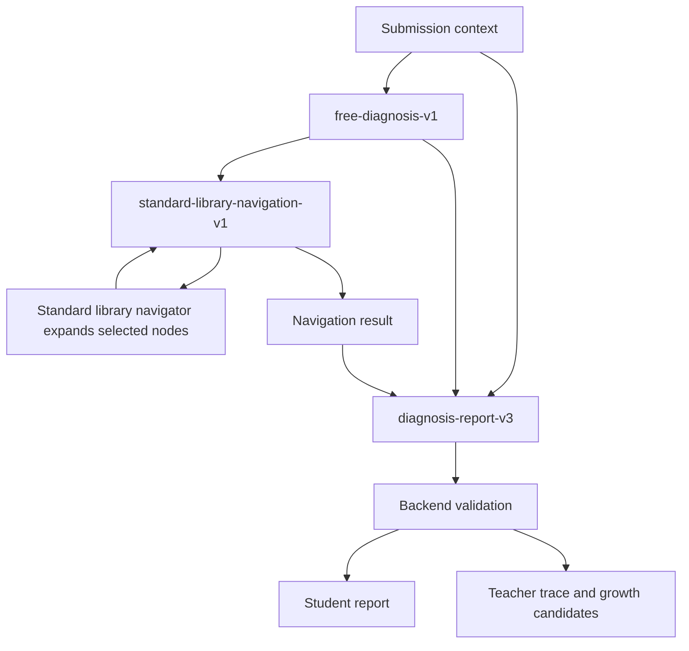

## Context

标准库已经完成方向调整：一棵知识树收束到知识点，知识点下挂能力点，能力点下挂易错点和提升点。高中术语和竞赛术语也不应拆库，而是在同一节点内用主名和别名统一。

现在的问题不在标准库结构本身，而在 AI 使用标准库的方式。当前默认链路仍使用后端本地召回，把标准库候选提前压给模型；用户希望改成由 AI 先理解题目和代码，再主动浏览标准库。

## Goals

- 默认学生诊断主链路不再使用后端本地召回。
- 模型先独立理解当前提交，再进入标准库导航。
- 标准库导航按树形结构逐层展开，避免一次性倾倒全库。
- 最终学生报告保持稳定，不把内部导航细节暴露给学生。
- 后端保留硬校验、失败关闭、教师审计和待审核成长候选。

## Non-Goals

- 不做 AI 自查循环。
- 不做导航失败后的自动重试循环。
- 不做 AI 资产实时直接写入正式标准库。
- 不保留本地召回作为默认 fallback。
- 不把高中库和竞赛库拆成两套库。

## Target Chain

### Stage 1: 初步诊断

输入：

- 题目描述、输入输出、限制。
- 学生完整带行号代码。
- 判题结果、失败样例、编译/运行错误。

输出：

- `problemUnderstanding`：题目目标和关键约束。
- `codeIntent`：学生代码看起来想做什么。
- `behaviorGap`：实际行为和题目要求的差距。
- `hypotheses`：可能错因，带证据引用。
- `navigationIntent`：建议从哪些知识方向进入标准库，但不得输出标准库 ID。

### Stage 2: AI 标准库导航

后端提供导航工具，不提供召回分数：

- `listRootKnowledgeAreas()`：返回一级目录。
- `expandKnowledgeNode(code)`：展开子节点。
- `expandDiagnosticLayer(knowledgePointCode)`：返回该知识点下能力点、易错点和提升点。

模型每轮选择：

- 选择 1-3 个分支继续展开。
- 说明选择理由和证据引用。
- 可以声明当前分支不合适。

边界：

- 默认最多 3 轮导航。
- 每轮最多选择 3 个分支。
- 最终标准库锚点建议控制在 8-12 个以内。
- 如果没有合适易错点，输出库外缺口，而不是强行命中。

### Stage 3: 最终诊断

输入：

- 原始提交上下文。
- 初步诊断草稿。
- 标准库导航结果。
- 导航选中的标准库结构包。

输出：

- `studentReport`：基础层诊断、诊断证据、提高层诊断、下一步动作。
- `diagnosisDecision`：是否通过、主要问题、是否泄题、置信度。
- `diagnosisCandidates`：标准库命中、部分命中、未命中或库外。
- `teacherTrace`：导航路径、证据、软修复和不确定性。
- `libraryGrowth`：待审核成长候选。

## Failure Policy

- 初步诊断失败：整条 AI 诊断失败关闭，不生成本地替代内容。
- 标准库导航失败：整条 AI 诊断失败关闭或返回阶段失败，不回退本地召回。
- 最终诊断失败：返回 AI 不可用，不用标准库条目拼接报告。
- 标准库 ID 不存在：后端按现有策略软修复或标记无效，但不得伪装为强命中。

## Migration Plan

1. 先新增规格、文档和任务清单，冻结新旧边界。
2. 新增 prompt 和 DTO：初步诊断、导航请求/响应、最终诊断 v3。
3. 给标准库服务增加导航 API，复用现有规范化表。
4. 改 `ExternalModelAgentRuntime` 和 `AiReportService`，默认走三阶段链路。
5. 把 `SearchLocationRetrievalService` 从学生实时主链路移除，保留为离线评测或删除。
6. 更新 trace、validator、测试和文档。

## Verification Strategy

- 单元测试证明默认链路不会调用 `SearchLocationRetrievalService.retrieve(...)`。
- 集成测试证明 trace 不再出现 `LOCAL_RECALL`。
- Prompt 测试证明初步诊断阶段不包含标准库包。
- 导航测试证明每轮只展开被 AI 选择的节点，且受轮次和分支数限制。
- 失败测试证明导航失败不会回退本地召回。
- 输出测试证明学生端仍能读取基础层、证据、提高层和下一步行动。
